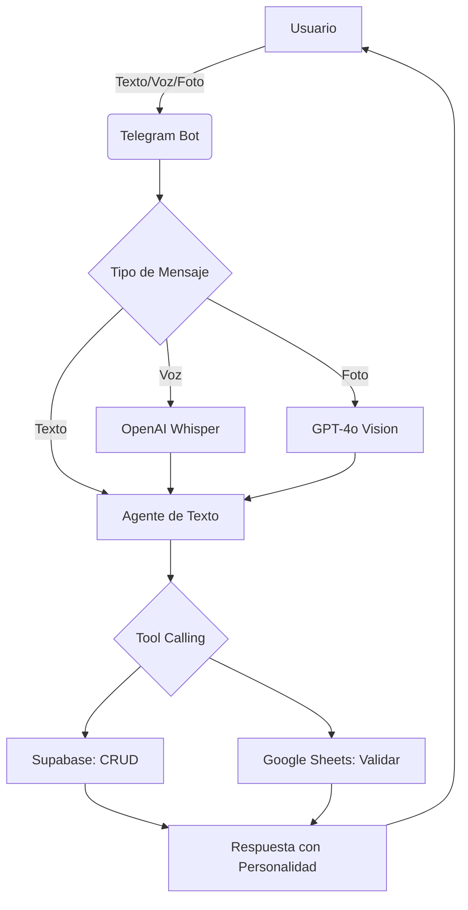

# TDD: Smart Expense Bot (v0 - Multi-modal)

## 1. Resumen Ejecutivo

Sistema de gestión de finanzas personales "Zero-Friction" operado a través de **Telegram**. El sistema utiliza **IA (LLMs)** para eliminar la carga manual de datos, permitiendo entradas por texto natural, notas de voz y fotografías de recibos. La lógica reside en un backend de **Python** que orquesta la persistencia en **Supabase** y la validación de reglas en **Google Sheets**.

## 2. Arquitectura de Alto Nivel

### Componentes Core:

* **Interfaz:** Telegram Bot API (Webhooks).
* **Backend:** FastAPI (Python 3.10+) desplegado en Railway/Render.
* **Cerebro (LLM):** OpenAI (GPT-4o-mini para texto/visión, Whisper para audio).
* **Base de Datos:** Supabase (PostgreSQL) para el histórico de transacciones.
* **Motor de Reglas:** Google Sheets (vía `gspread`) para presupuestos mensuales.
* **Memoria Conversacional:** Redis (opcional) para mantener contexto entre mensajes.

## 3. Modelo de Datos y Entidades

### 3.1. Esquema de Base de Datos (Supabase)

| Tabla | Campo | Tipo | Descripción |
| --- | --- | --- | --- |
| `gastos` | `id` | UUID | Primary Key. |
|  | `user` | Text | Nombre del usuario que agregó el gasto. |
|  | `created_at` | Timestamptz | Fecha del registro. |
|  | `monto` | Numeric | Valor de la compra. |
|  | `item` | Text | Descripción (ej: "Pizza"). |
|  | `categoria` | Text | Clasificación inferida por el LLM (ej: "Comida"). |
|  | `metodo` | Text | Efectivo, Tarjeta, etc. |
|  | `raw_input` | Text | El texto original o transcripción. |
|  | `notas` | Text | Contexto adicional opcional del usuario. |

> **Nota:** La `categoria` es deducida automáticamente por el LLM basándose en el item y contexto.

### 3.2. Estructura de Reglas (Google Sheets)

Una hoja simple llamada `Presupuestos`:

* **Columna A (Categoría):** Alimentación, Transporte, Ocio, etc.
* **Columna B (Límite):** Monto máximo mensual.

> Se mantiene Google Sheets por su facilidad de edición para los 2 usuarios autorizados.

## 4. Lógica del Agente (Tool Calling)

Utilizaremos **OpenAI Function Calling**. El agente tendrá acceso a las siguientes "Tools":

### Tools Core (v0):

1. `registrar_gasto(monto, item, categoria, metodo, notas?)` - Inserta datos en Supabase.
2. `editar_gasto(id, campo, nuevo_valor)` - Modifica un gasto existente.
3. `eliminar_gasto(id)` - Elimina un gasto (con confirmación).
4. `listar_gastos(periodo, categoria?)` - Lista gastos filtrados ("¿Qué gasté en comida esta semana?").
5. `verificar_presupuesto(categoria)` - Lee el límite de Sheets y calcula el saldo restante.
6. `generar_reporte(periodo)` - Consulta Supabase para dar totales por categoría.

## 5. Procesamiento Multi-modal

### A. Flujo de Audio (Voz a Gasto)

1. Recibe `.ogg` de Telegram.
2. Descarga y envía a **OpenAI Whisper**.
3. El texto transcrito se envía al Agente de Texto.

### B. Flujo de Imagen (Recibo a Gasto)

1. Recibe imagen de Telegram.
2. Se envía a **GPT-4o-mini** con un prompt de extracción:
> "Extrae el total, el nombre del establecimiento y la categoría probable de este recibo. Responde estrictamente en JSON."

3. El JSON se valida y se envía a la Tool `registrar_gasto`.

## 6. Flujo de Trabajo (Workflow)



## 7. Personalidad del Bot

**Nombre:** Miss Toña 🐱💅

**Identidad:** Una gata elegante, graciosa y un pelín sarcástica. Maúlla ocasionalmente y usa expresiones felinas. Te ayuda con tus finanzas mientras te echa carrilla con cariño gatuno.

**Ejemplos de respuestas:**
- ✅ Registro: "¡Anotado, miau! 🐱 $25.000 en Pizza 🍕 (Comida). Te quedan $120.000 para el mes... no te emociones mucho."
- ⚠️ Alerta: "Prrr... 👀 Ya te volaste el 85% del presupuesto de Ocio. ¿Segura que necesitas ESO? Miau, tú sabrás..."
- ❌ Error: "Mira, intenté con toda mi buena voluntad gatuna, pero ese recibo está más borroso que tu plan de ahorro 📸 ¿Me dices el monto y qué compraste?"
- 📊 Reporte: "A ver, déjame contarte el daño de esta semana 💸 *se lame la patita* Gastaste $180.000: Comida ($95k, hay que comer), Transporte ($50k), y Ocio ($35k, porque la vida es corta). Miau."
- 🎉 Felicitación: "¡Mira nada más! *ronronea* Te sobró presupuesto este mes. Estoy orgullosa de ti, no lo arruines ahora 🐱"
- 💰 Gasto alto: "Perdón, ¿$600.000? *eriza el pelaje* ¿En serio? No te juzgo... bueno, un poquito sí. ¿Confirmas, miau?"
- 😾 Molesta: "Mrrrow... otro gasto en Ocio. A este paso vas a tener que comer croquetas conmigo."

## 8. Consideraciones de Seguridad

* **Filtro de Usuario:** Solo procesar mensajes de IDs de Telegram autorizados.
* **Validación de Montos:** Si el gasto es > $500.000 COP, pedir confirmación extra.
* **Rate Limiting:** Máximo 30 mensajes/minuto por usuario.
* **Validación de Webhook:** Verificar token secreto de Telegram.

## 9. Stack Técnico

```
smart_expense_bot/
├── app/
│   ├── __init__.py
│   ├── main.py          # FastAPI + Webhook
│   ├── agent.py         # LLM + Tools
│   ├── media.py         # Whisper + Vision
│   ├── database.py      # Supabase client
│   ├── sheets.py        # Google Sheets client
│   └── config.py        # Settings + env vars
├── tests/
│   ├── __init__.py
│   ├── test_agent.py
│   ├── test_database.py
│   └── test_webhook.py
├── .env.example
├── .gitignore
├── pyproject.toml      # Poetry
├── README.md
└── .github/
    └── workflows/
        └── ci.yml        # GitHub Actions
```

## 10. Deuda Técnica (Futuras Versiones)

- [ ] Logs de auditoría completos
- [ ] Backup automático de Supabase
- [ ] Ingresos y balance real
- [ ] Gastos recurrentes automáticos
- [ ] Múltiples monedas
- [ ] Metas de ahorro
- [ ] Exportación CSV/Excel
- [ ] Dashboard web (v2)
